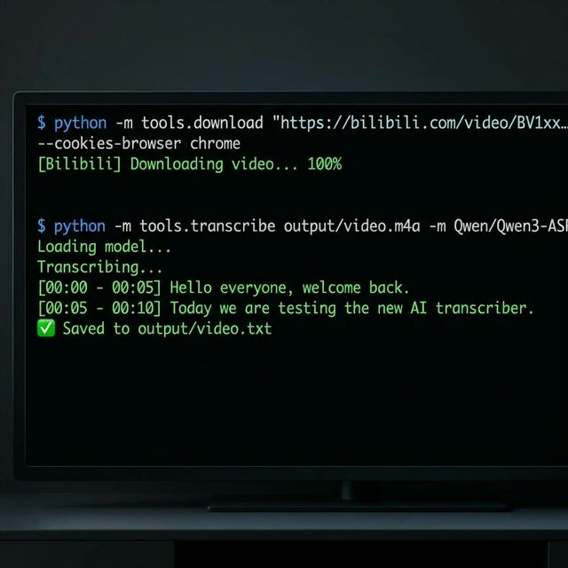

# Video-Skill-Transcriber 🎥

> A universal video processing toolkit for AI Agents. Download and transcribe content from anywhere.
> Bilibili / YouTube / Local Files

[](LICENSE)
[](https://www.python.org/downloads/)
[](https://github.com/JackMeds/Video-Skill-Transcriber/releases)

[中文说明 (Chinese README)](README_zh-CN.md)

---

## Table of Contents

- [Introduction](#introduction)
- [Features](#features)
- [Demo](#demo)
- [Installation](#installation)
- [Usage (CLI)](#usage-cli)
- [Bilibili Special Tutorial](#bilibili-special-tutorial)
- [For AI Agents (Skills)](#for-ai-agents-skills)
- [License](#license)

---

## Introduction

Video-Skill-Transcriber empowers your AI Agent to autonomously download videos from the web and transcribe audio into text using state-of-the-art models. Whether it's a YouTube tutorial, a Bilibili lecture, or a local file, this toolkit handles it all.

## Features

- **Universal Downloader**: Works with YouTube, Bilibili, TikTok, and thousands of other sites via [yt-dlp](https://github.com/yt-dlp/yt-dlp).
- **Flexible Auth**: Automatically use browser cookies (Chrome/Edge/Firefox) or Netscape cookie files for premium content access.
- **Multi-Engine Transcription**:
    - **Whisper**: Local, fast, general-purpose.
    - **Qwen3-ASR**: Local, high accuracy (especially for multilingual).
    - **OpenAI API**: Online, scalable (supports whisper-1/DeepSeek).

## Demo



## Installation

1.  **Clone the repository**:
    ```bash
    git clone https://github.com/JackMeds/Video-Skill-Transcriber.git
    cd Video-Skill-Transcriber
    ```

2.  **Install dependencies**:
    ```bash
    python3 -m venv .venv
    source .venv/bin/activate  # Windows: .venv\Scripts\activate
    pip install -r requirements.txt
    ```
    *(Requires [FFmpeg](https://ffmpeg.org/) installed)*

3.  **(Optional) Configure API**:
    Copy `.env.example` to `.env` if you want to use Online Transcription.

## Usage (CLI)

All tools are located in the `tools/` package and can be run with `python -m tools.xxx`.

### 1. Download Video

```bash
# YouTube
python -m tools.download "https://www.youtube.com/watch?v=dQw4w9WgXcQ"

# Use Browser Cookies (Recommended for age-gated content)
python -m tools.download "URL" --cookies-browser chrome
```

### 2. Transcribe Audio

```bash
# Local Whisper (Default)
python -m tools.transcribe "output/video.m4a"

# Local Qwen3-ASR
python -m tools.transcribe "output/video.m4a" -m Qwen/Qwen3-ASR-0.6B

# Online API
python -m tools.transcribe "output/video.m4a" -m openai
```

---

## Bilibili Special Tutorial

We offer unique workflows optimized for Bilibili users.

### Scenario: Batch Process "Watch Later" List

Turn your "Watch Later" playlist into text notes automatically.

1.  **Login (QR Code)**:
    Since API access is restricted, login once via QR code to save your session.
    ```bash
    python -m tools.auth
    ```

2.  **Fetch List**:
    Get the top 10 videos from your Watch Later list.
    ```bash
    python -m tools.list --watch-later --limit 10
    ```
    This saves a `batch_list.json` file.

3.  **Batch Run**:
    Execute the batch processor to download and transcribe them all.
    ```bash
    python -m tools.batch_run
    ```

### Scenario: High Quality / Member-Only Video

```bash
# Download using Chrome cookies (works if you are logged in on Chrome)
python -m tools.download "https://www.bilibili.com/video/BVxxx" --cookies-browser chrome --video
```

---

## For AI Agents (Skills)

Give the content of [`skills/VIDEO_SKILL.md`](skills/VIDEO_SKILL.md) to your AI Agent (Claude/ChatGPT). It serves as a manual enabling the AI to autonomously control these tools.

## License

MIT
